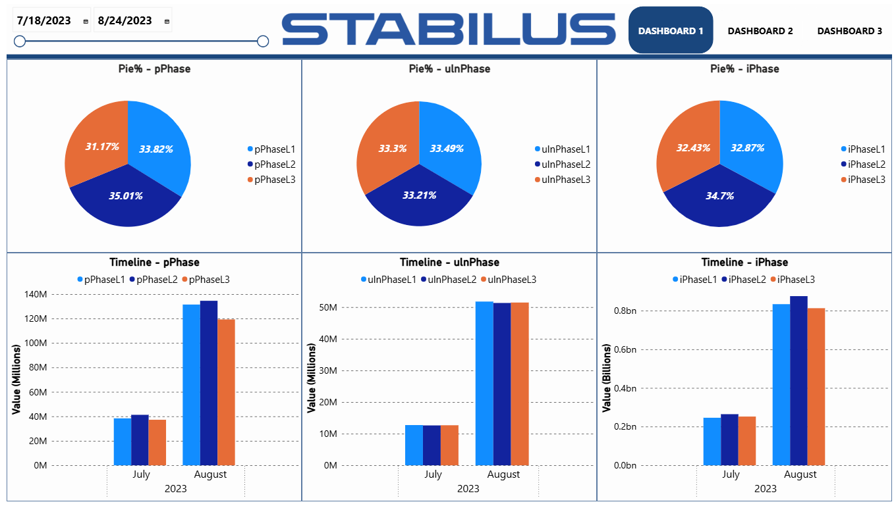
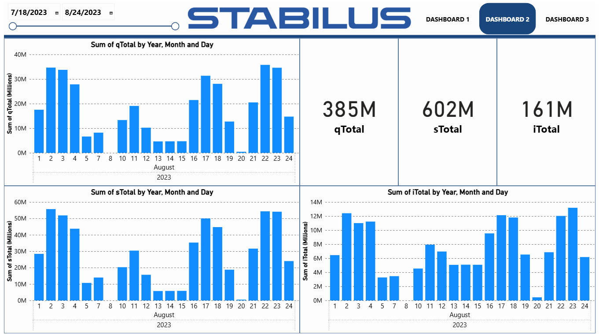
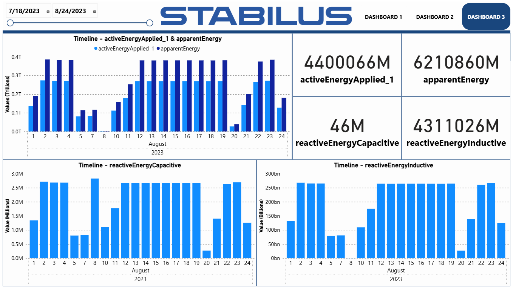

# 📊 PowerBI Project - Energy Consumption Analysis

⚠️ **Disclaimer:** The dataset used in this project is **fictitious**.  
This dashboard was created **only as a presentation model** and should not be interpreted as real operational data.

## 🔎 Description
**Application acces:** _[DaAn_Production_KPIs_STAB](https://app.powerbi.com/view?r=eyJrIjoiNzBjZDQ3YTQtZjhmMi00M2Q3LThhYzAtZDM4ZmU4MzE0MmRjIiwidCI6IjU5ZTJkYTQzLWI1N2UtNDA4Ny05OGEwLWI1NDlmODczNzE0MiIsImMiOjl9)_

This project was developed in **Power BI** with the purpose of analyzing different **energy consumption indicators** using an Excel dataset.  
The dashboards provide a clear view of the distribution and evolution of values, allowing users to compare consumption across different phases and time periods.

## 🗂️ Dataset
The dataset comes from an Excel file (`dataset.xlsx`), containing energy consumption values split into:
- **pPhase** – main phases consumption (L1, L2, L3)
- **uInPhase** – input phases consumption (L1, L2, L3)
- **iPhase** – current phases consumption (L1, L2, L3)

The data is stored daily and later aggregated for monthly and comparative analysis.

## 📈 Dashboards

### 🔵 Dashboard 1 – Phase Analysis
- **Pie charts** – percentage distribution of consumption across phases (L1, L2, L3).
- **Timeline charts** – monthly evolution for each phase.

➡️ Example visualization:  

---

### 🔵 Dashboard 2 – Daily Analysis & Totals
- **qTotal, sTotal, iTotal** – aggregated consumption values (in millions).  
- **Bar charts** – daily evolution of consumption for each indicator.  
- Provides an overview of consumption.  

➡️ Example visualization:  

---

### 🔵 Dashboard 3 – Energy Indicators
- **Timeline charts** showing the evolution of:
  - `activeEnergyApplied_1 & apparentEnergy`  
  - `reactiveEnergyCapacitive`  
  - `reactiveEnergyInductive`  
- **Cards with total values** for all four indicators, giving a quick summary of energy performance.

➡️ Example visualization:  

---

## 🚀 Features
- Compare energy consumption across phases (L1, L2, L3).  
- Analyze percentage distribution.  
- Track daily and monthly consumption trends.  
- Summarize key indicators with KPI cards (qTotal, sTotal, iTotal).  

## 🛠️ Tools & Technologies
- **Power BI Desktop** – dashboard creation and analysis.  
- **Excel** – source dataset.  

---

## 📝 How to Use
1. Open the `.pbix` file in **Power BI Desktop**.  
2. Connect it to the provided Excel dataset (`dataset.xlsx`).  
3. Use the interactive filters (date range, phase selection) to explore the data.  
4. Switch between dashboards for phase analysis, daily breakdowns, and aggregated KPIs.  

---

## 📌 Conclusions
The project provides a detailed overview of energy consumption, both in terms of percentage distribution across phases and its dynamics over time.  
This type of analysis supports decision-making for optimizing energy usage and identifying anomalies.  

---
